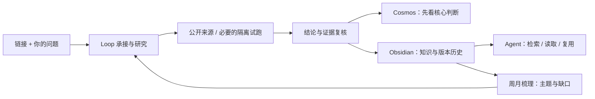

# Loop Graph Cosmos

**把一个链接和一个问题，逐步变成有证据的结论，再变成你和 Agent 都能复用的本地知识。**

Local research → evidence-backed conclusions → versioned knowledge for people and Agents.

**状态：v0.1.0 开发者预览。** 首次公开整理，面向愿意运行本地 Python 服务和 Obsidian 插件的个人用户。主要验证环境是 macOS；没有云托管服务，也尚未提交 Obsidian 社区插件市场。

[开始使用](docs/QUICKSTART.md) · [Agent 接入](docs/AGENT-USAGE.md) · [架构与边界](docs/ARCHITECTURE.md) · [已知限制](docs/LIMITATIONS.md) · [English](docs/README.en.md)



图中的再次研究受范围、优先级和执行资格约束；列出缺口不等于无限自动上网。

## 它解决什么

收藏链接容易，得到可用判断、记住判断依据、在新问题里再次使用它们很难。本项目围绕三个任务工作：

| 任务 | 希望得到的结果 | 当前实现 |
| --- | --- | --- |
| 理解并判断互联网信息 | 结论先行，证据、限制、图表按需展开 | 公开来源采集、订阅 Agent 综合与复核、问题覆盖检查 |
| 验证工具是否适用 | 回答是否适合、如何使用、条件和限制 | 有边界的仓库/依赖试跑；不能执行时保留真实失败，不冒充验证 |
| 建立可继续生长的第二外脑 | 分类目录、当前结论、旧版本、周月主题和缺口 | 本地 Markdown + JSON、稳定知识 ID、CAS 修订、只读知识 API、周期梳理 |

Loop 保存任务推进与恢复状态，Graph 承担有依赖和授权边界的执行；Cosmos 是人的工作台。模型/Agent 提供研究与判断能力，知识目录和 API 让后续 Agent 不必读源码或历史聊天才能消费结果。

## 快速看到价值

无需模型、无需联网的演示会：

1. 保存一条带证据引用的**合成结论**。
2. 追加修订，保留可读取的旧版本。
3. 生成分类目录，并返回 Agent 的使用步骤与限制。

```sh
cd backend
python3.11 -m venv .venv
source .venv/bin/activate
python -m pip install -r requirements.txt
python scripts/demo.py --vault "$PWD/demo-vault"
```

目标目录必须不存在，避免覆盖已有笔记。安装依赖需要网络；演示本身不抓网页、不调用模型。演示不会证明任何真实项目的能力。[启动 API 和 Obsidian 工作台 →](docs/QUICKSTART.md)

## 已验证到什么程度

公开包包含研究、执行边界、来源过滤、幂等恢复、知识修订和 UI 的定向回归测试；[验证记录](docs/VALIDATION.md)列出实际执行结果。

项目来源于个人真实使用与持续修复。曾用于公开 GitHub 项目适配、新闻来源核对和论文阅读，但本仓库没有复制个人研究档案，也没有把开发者手工研究冒充系统自动产物。公开演示只使用明确标注的合成材料。

长期目标是每日碎片持续归入“大类 → 小类 → 主题”，新证据修订旧结论，周月梳理形成可补足的知识结构。**300 条合成输入的检查不等于一个月无人值守；代码自修改、自部署及通用商业模块市场都不是本版承诺。**

## 参与

欢迎从一个可复现案例开始：输入的问题是什么、预期核心判断是什么、实际停在哪里。尤其欢迎新机器安装反馈、Agent 消费效果，以及“看起来完成但没有回答问题”的反例。

提交前阅读 [CONTRIBUTING.md](CONTRIBUTING.md)。不要在 Issue 中贴凭据、私人笔记或生产数据库。项目使用 [MIT License](LICENSE)；第三方工具与服务遵守各自许可及账户条款。
